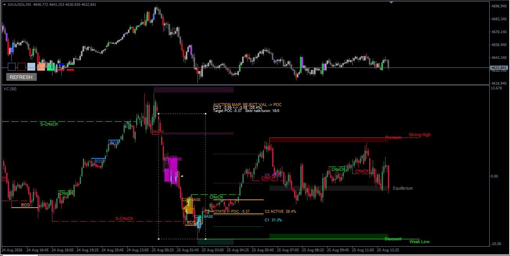

# ValueChart

**Oscillator harga ternormalisasi untuk MetaTrader 4 — plus liquidity, auction map, dan deteksi struktur pasar dalam satu panel.**

*oleh Denta Ah*

---

## Daftar Isi

- [Ringkasan](#ringkasan)
- [Fitur Utama](#fitur-utama)
- [Cara Kerja (Konsep Umum)](#cara-kerja-konsep-umum)
- [Kebutuhan Sistem](#kebutuhan-sistem)
- [Instalasi](#instalasi)
- [Cara Pakai](#cara-pakai)
- [Konfigurasi](#konfigurasi)
- [Tampilan](#tampilan)
- [Disclaimer](#disclaimer)
- [Lisensi](#lisensi)

---

## Ringkasan

**ValueChart** adalah indikator subwindow MT4 yang mengubah price action menjadi **oscillator ternormalisasi** — bukan menampilkan harga apa adanya, melainkan seberapa jauh harga menyimpang dari nilai wajarnya (*fair value*) dalam satuan yang konsisten, apa pun instrumen atau timeframe yang sedang dibuka.

Di atas oscillator dasar ini dipasang tiga lapis analisa tambahan yang biasanya hanya ditemukan terpisah-pisah di tool order flow kelas institusional: **Liquidity Scenario** (peta zona likuiditas & proyeksi skenario pergerakan), **Auction Map** (profil volume ter-cluster & skor regime auction), dan **CHoCH/BOS Structure Detector** (deteksi *Break of Structure* & *Change of Character* ala Smart Money Concepts).

Karena keempatnya dihitung di atas skala oscillator yang sama persis — bukan harga mentah yang berbeda-beda skalanya — pembacaan overbought/oversold, zona likuiditas, cluster volume, dan struktur pasar semuanya saling nyambung dan konsisten, sekaligus bisa dibandingkan apel-ke-apel antar simbol atau timeframe yang berbeda.

## Fitur Utama

### 📈 Oscillator Ternormalisasi
Mengubah Open/High/Low/Close jadi oscillator `(Price − MA) / Range`, digambar sebagai candle di panel terpisah di bawah chart. Tiga level ambang (*Fair Value*, *Moderately Over/Under-valued*, *Significantly Over/Under-valued*) bisa ditampilkan sebagai garis referensi, lengkap dengan alert (popup/sound/email) saat harga menyentuh level tersebut.

### 🧲 Liquidity Scenario
Gambar satu rectangle langsung di panel ValueChart, dan modul ini otomatis memindai range tersebut untuk zona **Imbalance** (gap 3-candle) dan **Stop-Pool** (pivot high/low yang belum diuji). Tiap zona dinilai dengan skor 0–10 (volume, ukuran, jumlah retest, confluence, jarak ke harga saat ini, plus peluruhan skor seiring usia), lalu dirangkai jadi satu **Scenario** proyeksi: *Trigger → Reverse → Retest → Target* (opsional *Extension*).

### 🎯 Auction Map
Dipicu rectangle yang sama dengan Liquidity Scenario: membangun profil volume ter-cluster (Gaussian-smoothed) lengkap dengan Value Area per cluster dan POC-nya masing-masing, mendeteksi **regime auction** saat ini (*compression*, *probe*, *accepted migration*, *rejection*, *failed break*), menampilkan **capsule historis** tiap cluster (bagaimana volume di level itu berkembang pada kunjungan-kunjungan sebelumnya), serta proyeksi **target path** ke auction berikutnya.

### 🔀 CHoCH/BOS Structure Detector
Berjalan otomatis tanpa perlu rectangle — mendeteksi struktur pasar **Internal** (jangka pendek) dan **Swing** (jangka panjang) ala *Smart Money Concepts*: **Break of Structure (BOS)** dan **Change of Character (CHoCH)**, lengkap dengan zona **Premium / Equilibrium / Discount** dan penanda **Strong/Weak High-Low**.

> Ketiga modul tambahan ini membaca dari buffer oscillator yang sama persis dengan yang menggambar candle ValueChart, sehingga zona likuiditas, cluster auction, dan level struktur yang muncul semuanya berada di skala yang sama dan saling terhubung — bukan hasil hitungan terpisah dari data harga mentah yang tidak berkaitan.

## Cara Kerja (Konsep Umum)

ValueChart menjalankan dua mekanisme berbeda secara berdampingan:

1. **Otomatis, tanpa setup** — oscillator dasar dan CHoCH/BOS Structure Detector langsung aktif begitu indikator dipasang. Tiap bar baru langsung dihitung dan digambar; tidak perlu gambar apa pun.
2. **Dipicu rectangle, untuk analisa on-demand** — Liquidity Scenario dan Auction Map baru bekerja saat Anda menggambar satu rectangle **di panel ValueChart itu sendiri** (bukan di chart harga utama) mengelilingi area oscillator yang ingin dipelajari lebih dalam. Kedua modul otomatis mendeteksi rectangle tersebut dan menganalisis range di dalamnya.
3. Geser atau ubah ukuran rectangle kapan saja — Liquidity Scenario dan Auction Map menghitung ulang secara live mengikuti bentuk rectangle terbaru.
4. Semua hasil — garis struktur, kotak zona, label skor, profil cluster — dirender langsung di panel ValueChart, memakai skala oscillator yang sama dengan candle-nya, dan diperbarui live setiap kali harga bergerak.

Rumus skoring dan pembobotan internal (Liquidity Scenario, Auction Map) secara sengaja tidak dipublikasikan secara rinci di sini. Yang didokumentasikan adalah **apa** yang diukur tiap modul secara konsep dan **bagaimana** cara mengatur (konfigurasi) perilakunya — bukan cara kerja internalnya secara detail.

## Kebutuhan Sistem

- MetaTrader 4 (disarankan build 600 ke atas)
- Bisa dipakai di simbol/timeframe apa saja
- Objek Rectangle (`OBJ_RECTANGLE`) yang digambar manual **di panel ValueChart** (bukan di chart harga utama) — ini yang mendefinisikan range analisis untuk Liquidity Scenario & Auction Map. Oscillator dasar dan CHoCH/BOS Structure Detector tidak membutuhkan rectangle sama sekali, jalan otomatis.
- Fitur rectangle (Liquidity Scenario & Auction Map) hanya aktif saat parameter `TimeFrame` indikator sama dengan timeframe chart yang sedang dibuka — mode Multi-Timeframe tidak didukung untuk kedua modul ini (oscillator utama tetap jalan normal di mode apa pun).

## Instalasi

1. Salin file `.mq4` ke folder `MQL4/Indicators` pada instalasi MetaTrader 4 Anda.
2. Restart MetaTrader 4, atau refresh panel Navigator.
3. Drag indikator ke chart yang diinginkan — ia akan muncul sebagai panel terpisah di bawah chart harga.
4. Oscillator dan CHoCH/BOS Structure Detector langsung aktif; gambar rectangle di panel tersebut kapan pun Anda butuh analisa Liquidity Scenario & Auction Map.

## Cara Pakai

1. Pasang ValueChart ke chart — oscillator dan CHoCH/BOS Structure Detector langsung aktif otomatis.
2. Untuk Liquidity Scenario & Auction Map: gunakan tool Rectangle bawaan platform (`Insert → Shapes → Rectangle`), lalu gambar **di panel ValueChart** (bukan di chart harga) mengelilingi area oscillator yang ingin dipelajari.
3. ValueChart secara otomatis akan:
   - Menandai zona Imbalance/Stop-Pool beserta proyeksi Scenario (Liquidity Scenario)
   - Menampilkan cluster volume, Value Area, dan regime auction terkini (Auction Map)
   - Menandai BOS/CHoCH Internal & Swing beserta zona Premium/Discount (otomatis, tanpa rectangle)
4. Geser atau ubah ukuran rectangle kapan saja — Liquidity Scenario dan Auction Map menghitung ulang secara live.
5. Sesuaikan modul mana yang ingin ditampilkan dan seberapa sensitif masing-masing lewat parameter input (lihat bagian Konfigurasi).

## Konfigurasi

Input dikelompokkan per modul (Levels, Liquidity Scenario, Auction Map, CHoCH/BOS Structure, Zona Premium-Discount, Alert), sehingga Anda bisa:

- Menyalakan/mematikan tiap modul secara independen
- Mengatur warna, opacity, dan ukuran font agar tampilan panel lebih bersih atau lebih menonjol sesuai selera
- Menyesuaikan ambang sensitivitas (mis. skor minimum zona Liquidity Scenario agar dianggap valid, jumlah cluster maksimum Auction Map, panjang pivot Internal/Swing pada CHoCH/BOS) supaya cocok dengan karakter volatilitas instrumen dan gaya trading Anda sendiri
- Mengatur alert (popup, sound, push notification) untuk sinyal BOS/CHoCH baru
- Mengatur seberapa jauh garis/kotak zona ditampilkan dan seberapa detail informasi yang ditampilkan di dalamnya

Setiap modul bisa dijalankan berdampingan atau sendiri-sendiri — matikan saja modul yang tidak Anda butuhkan.

## Tampilan

<!--  -->
<!--  -->
<!--  -->
<!--  -->

## Disclaimer

ValueChart adalah tool visualisasi order flow & struktur pasar yang bersifat **statistik/heuristik**. Skor, zona, label, dan proyeksi Scenario/Target Path apa pun yang ditampilkan mencerminkan jejak pada data volume dan harga historis di dalam rentang yang diplot — **bukan** sinyal trading, jaminan hasil, atau pengganti analisa struktur pasar, manajemen risiko, dan penilaian Anda sendiri. Selalu validasi dengan konteks tambahan (struktur higher-timeframe, berita, aturan strategi Anda sendiri) sebelum mengambil keputusan trading.

## Lisensi

*All Rights Reserved*
